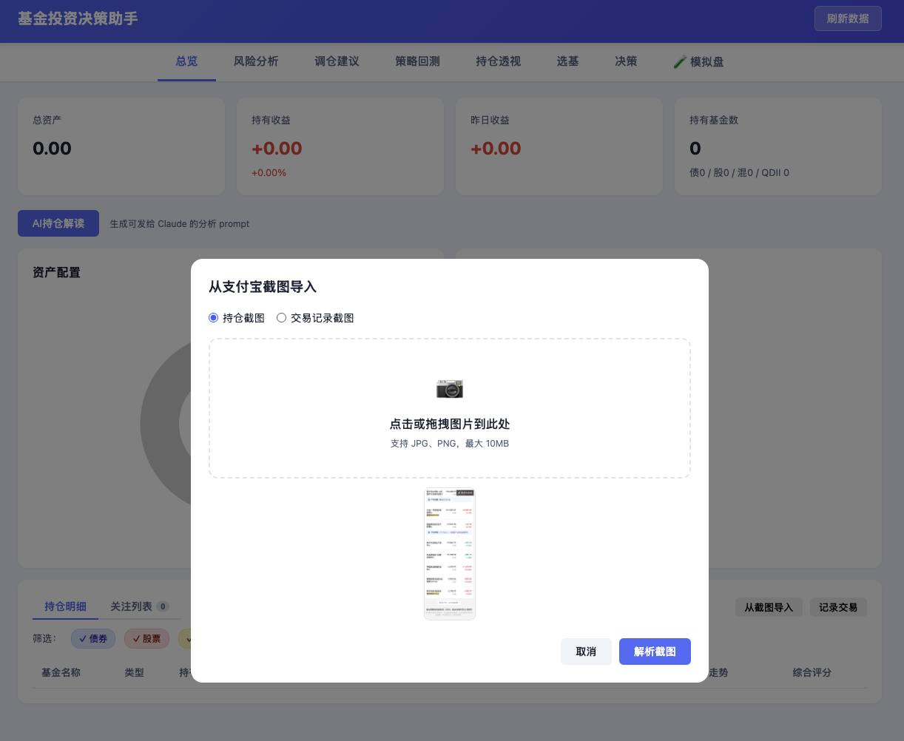
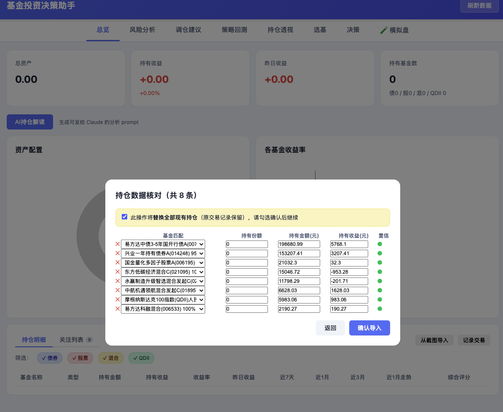
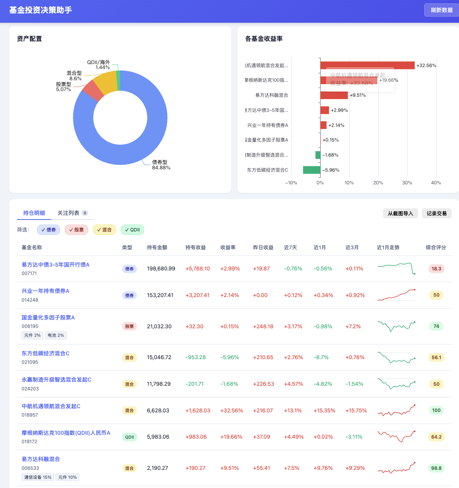
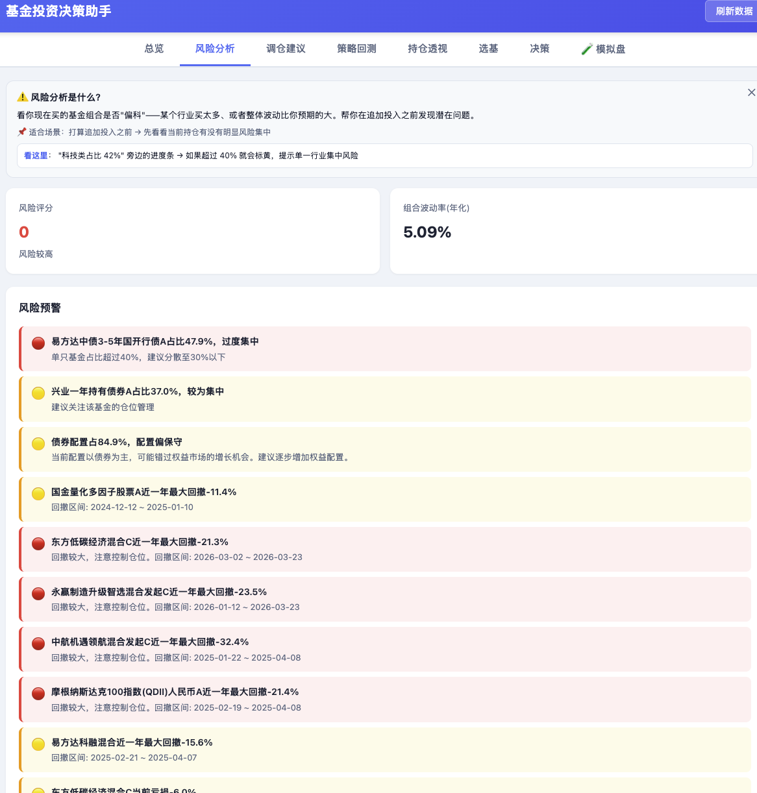
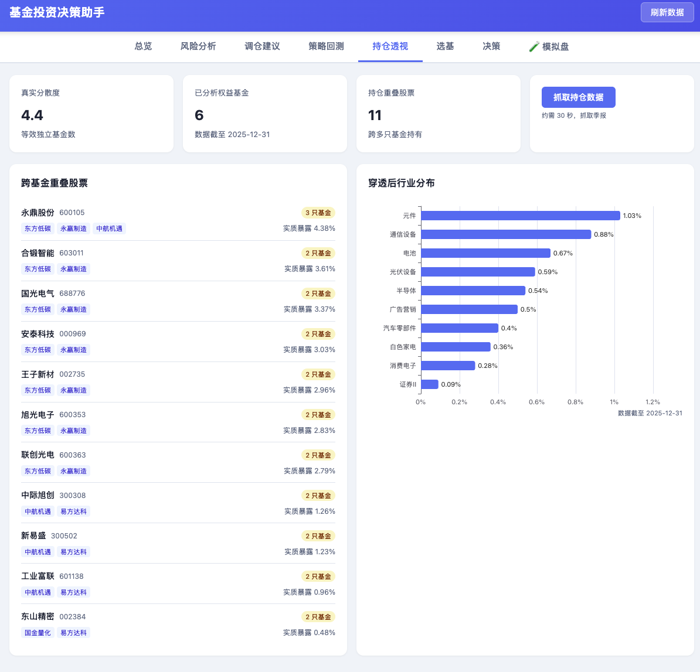
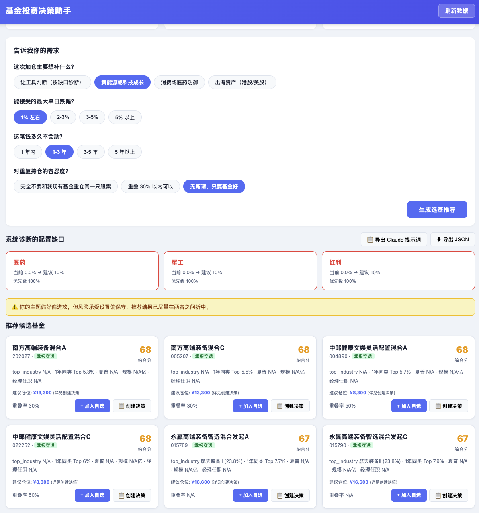
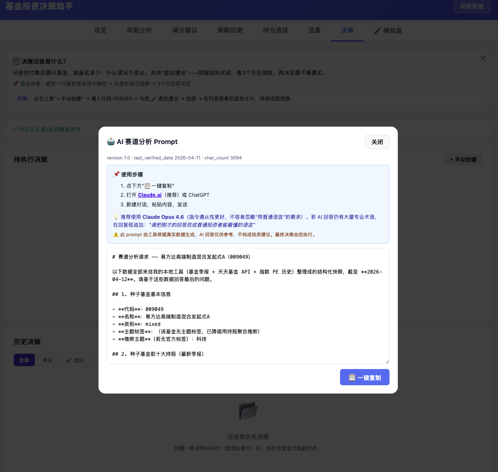
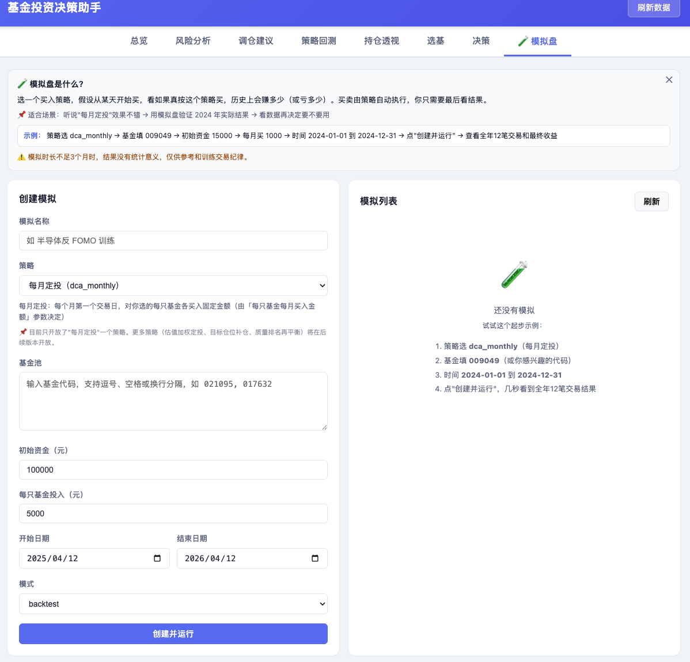

# 散户 sanhu

> 普通人买基金的决策助手。帮你看懂、帮你比较、帮你模拟 —— 最终由你决定。

---

## 这是什么

支付宝里买了几只基金，但不知道买得好不好？每次追涨杀跌，事后总是后悔？

sanhu 是一个**本地运行的基金投资辅助工具**，连接公开数据，帮普通投资者做三件事：

1. **看懂自己的持仓** — 当前盈亏、仓位分布、各基金综合评分
2. **做决策前先模拟** — 虚拟建仓观察，策略回测验证，不花真钱先试
3. **生成 AI 分析 Prompt** — 把你的真实持仓数据整理成结构化 Prompt，发给 Claude / ChatGPT 获取分析

工具不替你下单，不接入任何 AI 后端，不存储你的账户信息。

---

## 快速开始

### Mac

1. 下载或 clone 本仓库
2. 双击 **`install.command`** — 自动安装依赖、初始化数据库、启动服务、打开浏览器
3. 以后每次启动：双击 **`start.command`**

> 首次运行 macOS 可能提示"无法验证开发者"，右键 → 打开 → 确认即可

### Windows

1. 下载或 clone 本仓库
2. 双击 **`install.bat`** — 同上
3. 以后每次启动：双击 **`start.bat`**

> 需要预先安装 [Python 3.9+](https://www.python.org/downloads/)，安装时勾选 **Add Python to PATH**

### 命令行（高级用户）

```bash
git clone https://github.com/pakoo/sanhu.git
cd sanhu
pip install -r requirements.txt
python scripts/init_db.py
python app.py
```

浏览器打开 [http://localhost:8000](http://localhost:8000)

---

## 截图导入持仓（30秒搞定）

打开支付宝 → 基金账户 → 持有页面截图，上传即可自动识别。

**第一步：上传支付宝持仓截图**



**第二步：核对识别结果**

OCR 自动提取基金名称、持有金额、持有收益，可手动修正后确认导入。



**第三步：总览一目了然**



---

## 功能展示

### 风险分析

自动计算持仓波动率、相关系数热力图，多级预警提示集中风险。



### 持仓透视

穿透基金包装，看底层持股重叠情况和真实行业分布。



### 智能选基

诊断当前配置缺口，问卷式引导，从 8000+ 只基金中推荐候选，附综合评分和建议仓位。



### AI 持仓解读

一键生成结构化持仓分析 Prompt，复制后发给 Claude / ChatGPT 获取专业解读。数据不离开本机。



### 模拟盘

设置 DCA 定投等策略，用历史真实净值验证效果，或从今天开始前向模拟。



---

## 功能一览

| 模块 | 功能 |
|---|---|
| **持仓总览** | 总市值、盈亏、资产配置饼图、各基金7天/1月/3月走势 |
| **关注列表** | 自选基金跟踪，30天走势迷你图，综合评分徽章 |
| **风险分析** | 持仓相关性热力图、波动率分析、多级预警 |
| **持仓透视** | 穿透基金看底层重叠持股和行业暴露 |
| **调仓建议** | 对照目标配置，自动识别超配/低配 |
| **选基向导** | 问答式引导，从 8000+ 基金中筛选候选 |
| **策略模拟** | DCA定投等策略，历史回测 + 前向模拟 |
| **决策记录** | 记录买入计划，支持虚拟建仓（假钱观察真结果） |
| **AI 入口** | 生成数据丰富的持仓分析 Prompt |
| **市场估值** | 沪深300 / 中证500 PE百分位实时显示 |

---

## 使用手册

详细的功能说明和操作教程请查看 **[使用手册](docs/guide.md)**，涵盖所有功能模块的用法和常见问题。

---

## 技术栈

- **后端**：Python + FastAPI + SQLite
- **前端**：原生 HTML/CSS/JS（无框架依赖）
- **图表**：ECharts

数据全部本地存储，不上传任何个人信息。

---

## 项目设计原则

- **工具辅助，用户执行**：工具帮你分析，买卖由你决定，不接入任何自动交易接口
- **可达性不降级专业深度**：术语旁有 ⓘ 说明，但原始数据不被简化替换
- **无后端 AI**：不调用任何 LLM API，AI 功能通过生成 Prompt 让用户自己去问

---

## 数据说明

### 内置数据（`data/seed.sql`）

首次安装时自动加载，无需联网：

| 数据表 | 内容 | 行数 |
|---|---|---|
| `fund_profile` | 基金档案：类型、风格、主题标签、规模 | ~28,000 条 |
| `fund_peer_ranks` | 同类百分位排名 | ~18,000 条 |
| `index_pe_history` | 沪深300 / 中证500 近10年 PE/PB 历史 | ~9,700 条 |
| `nav_history` | 部分基金净值历史 | ~6,300 条 |
| `fund_holdings` | 部分基金持仓穿透数据 | ~200 条 |

> `fund_profile` 中的分类数据大部分由本地规则推断生成（`profile_source: inferred`），并非全部来自实时接口。

### 运行时更新

点击右上角「刷新数据」后，工具会通过公开接口补充：
- 你关注和持仓的基金最新净值
- 市场 PE/PB 估值数据

净值数据**按需拉取**（只拉你关注的基金），不会全量下载全市场数据。

### 隐私说明

所有数据保存在本机 `data/` 目录的 SQLite 文件中，不上传任何个人信息或持仓数据。

---

## 更新日志

### v1.1（2026-04）

**功能优化**

- **OCR 引擎替换（#1）**：将截图识别从 easyocr 切换至 [OCR.space](https://ocr.space) 云端 API
  - 安装体积从 ~724MB 降至 ~150MB，减少约 80%
  - 移除 PyTorch / scipy / opencv 大型依赖，仅保留轻量 HTTP 调用
  - 中文识别效果与原方案相当，支持支付宝持仓截图逐行输出格式

- **Windows 编码兼容（#2）**：修复 Windows cmd.exe（cp936）环境下的乱码和崩溃问题
  - `install.bat` / `start.bat` 新增 `PYTHONIOENCODING=utf-8` 环境变量
  - 替换 `scripts/init_db.py` 中的 emoji 状态符（`✓ ✗ ○` → `[OK] [--] [-]`），消除 `UnicodeEncodeError`
  - 替换 `install.bat` 中的 emoji 提示符，避免 cp936 控制台解码失败

---

## 联系作者

有任何问题、建议或想法，欢迎扫码加微信交流：


---

## License

MIT
